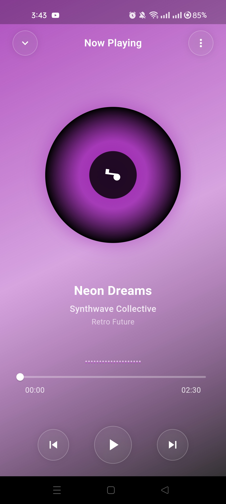
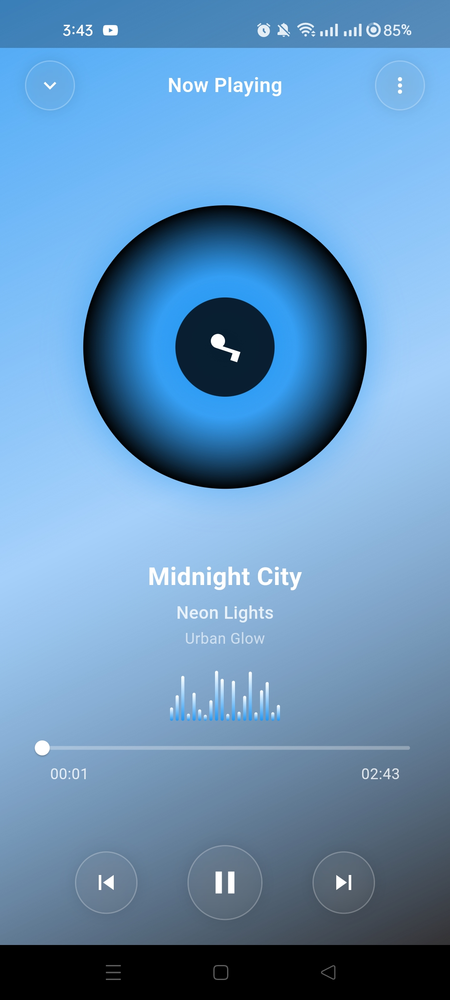
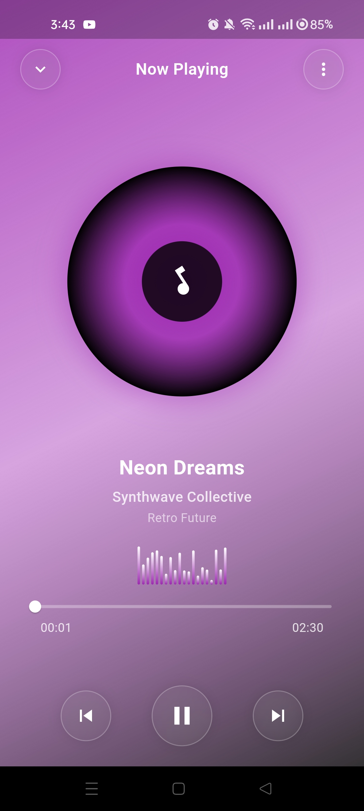
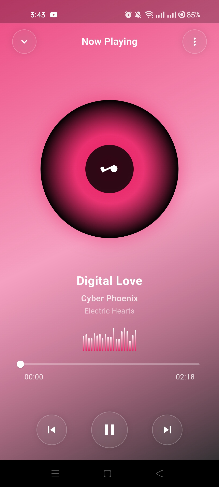

# 🎵 Glassmorphism Music Player

[](https://flutter.dev)
[](https://dart.dev)
[]()
[]()
[](https://opensource.org/)

---

## 🎨 Overview

**Glassmorphism Music Player** is a **stunning Flutter application** that combines **cutting-edge glassmorphism design** with **real audio playback functionality** — featuring frosted glass effects, smooth animations, and a fully functional music player experience.

This project serves as a **premium showcase** for developers exploring advanced Flutter UI design, audio integration, and creating professional-grade music applications with modern design aesthetics.

---

## 🎬 Preview

<div align="center">
  
  
  *Experience music with stunning visual design*
  <video src="https://github.com/user-attachments/assets/2d4c76de-c485-4e8e-a71e-044a59e81e6f" controls width="100%" ></video>

    
</div>


---

## ✨ Features

### 🎵 **Audio Playback**
* 🎶 **Real Audio Player** — Full-featured music playback with controls
* ⏯️ **Play/Pause/Skip** — Complete playback control system
* 🔊 **Volume Control** — Adjustable volume with elegant UI

### 🎨 **Stunning UI Design**
* 💎 **Glassmorphism Effect** — Frosted glass aesthetic with blur backdrop
* 🌈 **Dynamic Gradients** — Beautiful color transitions and overlays
* ✨ **Smooth Animations** — Fluid transitions and micro-interactions

---

## 📸 Screenshots

<div align="left">
  <table>
    <tr>
      <td></td>
      <td></td>
      <td></td>
      <td></td>
    </tr>
  </table>
</div>

---

## 🎥 Demo Video

Watch the **Music Player** in action:
<div align="center">
<video src="https://github.com/user-attachments/assets/df9e483d-3ea9-4180-b95c-407f1783f1f7" controls width="100%" ></video> 
</div>


---

## 🏗️ Tech Stack

| Technology                          | Description                                          |
| ----------------------------------- | ---------------------------------------------------- |
| **Flutter**                         | Cross-platform framework for building beautiful apps |
| **Dart**                            | Core programming language powering Flutter apps      |
| **CustomPainter & Animation**       | Used for rendering and dynamic effects               |
| **Material Design + Neuromorphism** | Blends modern and soft 3D design principles          |

---

## ⚙️ Installation & Setup

Follow these steps to run the project locally:

### 1️⃣ Clone the Repository

```bash
git clone https://github.com/<your-username>/Neuromorphism-Digital-Clock.git
cd Neuromorphism-Digital-Clock
```

### 2️⃣ Install Dependencies

```bash
flutter pub get
```

### 3️⃣ Run the App

```bash
flutter run
```

---

## 💡 Learning Outcomes

By working with this project, you'll gain insights into:

* 🎨 **Advanced UI Design** — Implementing glassmorphism and modern aesthetics
* 🎵 **Audio Integration** — Working with Flutter audio packages
* ✨ **Custom Animations** — Creating smooth, professional animations
* 🎯 **Best Practices** — Clean architecture and code organization
* 🔊 **Audio Service** — Background audio playback implementation


---

## 🤝 Contributing

Contributions are encouraged! If you’d like to enhance the design or functionality:

1. Fork the repository
2. Create a new branch (`git checkout -b feature/your-feature`)
3. Commit your changes (`git commit -m 'Add a new feature'`)
4. Push to the branch (`git push origin feature/your-feature`)
5. Open a Pull Request

---
🧠 Flutter Development Environment Setup

This project is built using Flutter. Below are the essential details and configuration requirements for replicating the development environment.

| Component              | Details                                      |
| ---------------------- | -------------------------------------------- |
| **Flutter Version**    | 3.27.1 (Stable Channel)                      |
| **Framework Revision** | 17025dd882                                   |
| **Engine Revision**    | cb4b5fff73                                   |
| **Dart Version**       | 3.6.0                                        |
| **DevTools Version**   | 2.40.2                                       |
| **Operating System**   | Windows 10 (Version 10.0.26200.6725, 64-bit) |
| **Locale**             | en-US                                        |


💻 Android Studio

* Version: 2023.3
* Java Runtime: OpenJDK 17 (17.0.10+0--11572160)

---

## 🤝 Contributing

Contributions are highly encouraged! Here's how you can help:

1. 🍴 **Fork** the repository
2. 🌿 **Create** a new branch (`git checkout -b feature/amazing-feature`)
3. 💾 **Commit** your changes (`git commit -m 'Add amazing feature'`)
4. 📤 **Push** to the branch (`git push origin feature/amazing-feature`)
5. 🎉 **Open** a Pull Request

---

## 💬 Connect & Support

For questions, feedback, or collaborations:

<div align="center">

[](https://github.com/yourusername)
[](https://x.com/yourusername)
[](https://www.linkedin.com/in/yourprofile)
[](mailto:your.email@example.com)

</div>

---

## 🌟 Show Your Support

If this project helped you or inspired your work:

<div align="center">

⭐ **Star this repository**  
🍴 **Fork it for your projects**  
📢 **Share with the Flutter community**  
💖 **Sponsor the development**  
🐛 **Report issues or suggest features**

</div>

---

## 📊 Project Stats

<div align="center">


</div>

---

<div align="center">

**Made with ❤️, Flutter, and 🎵**

*Bringing music to life with stunning design*

### 🎵 *"Where Design Meets Melody"* 🎵

</div>
